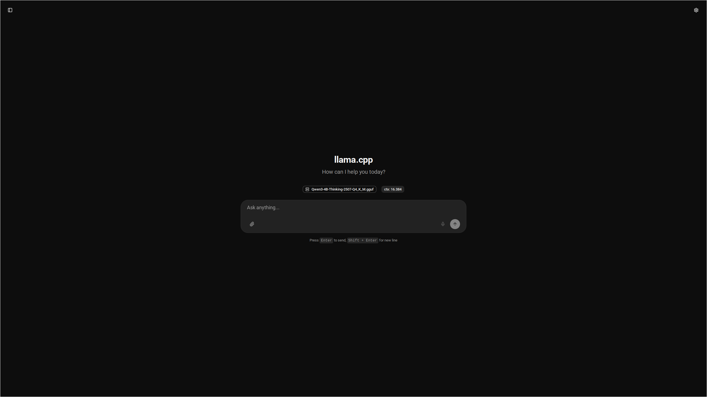

# Llama.cpp Docker Compose Example

This repository provides a straightforward, working example of how to download, convert, quantize, and serve a Large Language Model (LLM) using the `llama.cpp` Docker image and Docker Compose.

The goal is to offer a simple, ready-to-use project for anyone looking to get started with `llama.cpp` in a containerized environment with NVIDIA GPU acceleration.



## Prerequisites

Before you begin, ensure you have the following software installed on your system (see system_requirements.txt):

- git
- git-lfs
- docker
- docker-compose
- nvidia-container-toolkit

## Usage

1.  **Clone the repository:**
    ```bash
    git clone https://github.com/cyprienbf/llamacpp-example.git
    cd llamacpp-example
    ```

2.  **Run the script:**
    The `run.sh` script will handle everything for you: downloading the model, converting it, quantizing it, and starting the server.
    ```bash
    bash run.sh
    ```

3.  **Access the server:**
    Once the script is finished, you can access the `llama.cpp` web server at [http://localhost:8080](http://localhost:8080).

Of course. Here is a new section for your `README.md` that explains which model is being used and how to change it. You can place this section after the "Prerequisites" and before the "Usage" section.

## Model Used

This example uses the `Qwen/Qwen3-4B-Thinking-2507` model from [Hugging Face](https://huggingface.co/Qwen/Qwen3-4B-Thinking-2507) by default.

However, you are free to use any other compatible model. To do so, you will need to update the model repository URL and file paths in the following files:

1.  **`run.sh`**:
    -   Modify the `MODEL_REPO` and `MODEL_NAME` variables to point to your desired model on Hugging Face.

2.  **`docker-compose.yml`**:
    -   Update the model file paths in the `command` sections for the `convert`, `quantize`, and `server` services to match the new model's file structure.

## Credits

This example is built upon the excellent work of the `llama.cpp` project. For more detailed information on using their Docker image, please refer to their official documentation:

-   [Llama.cpp Docker Documentation](https://github.com/ggml-org/llama.cpp/blob/master/docs/docker.md)
-   [Qwen3 4B Thinking 2507 on Hugging Face](https://huggingface.co/Qwen/Qwen3-4B-Thinking-2507)

## License

This project is licensed under the MIT License. See the `LICENSE` file for details.